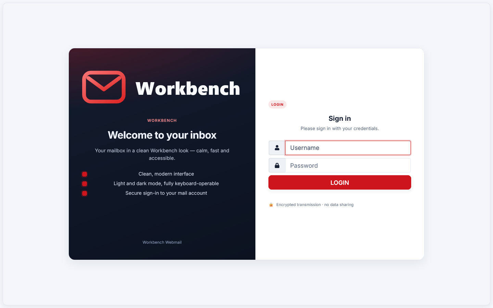
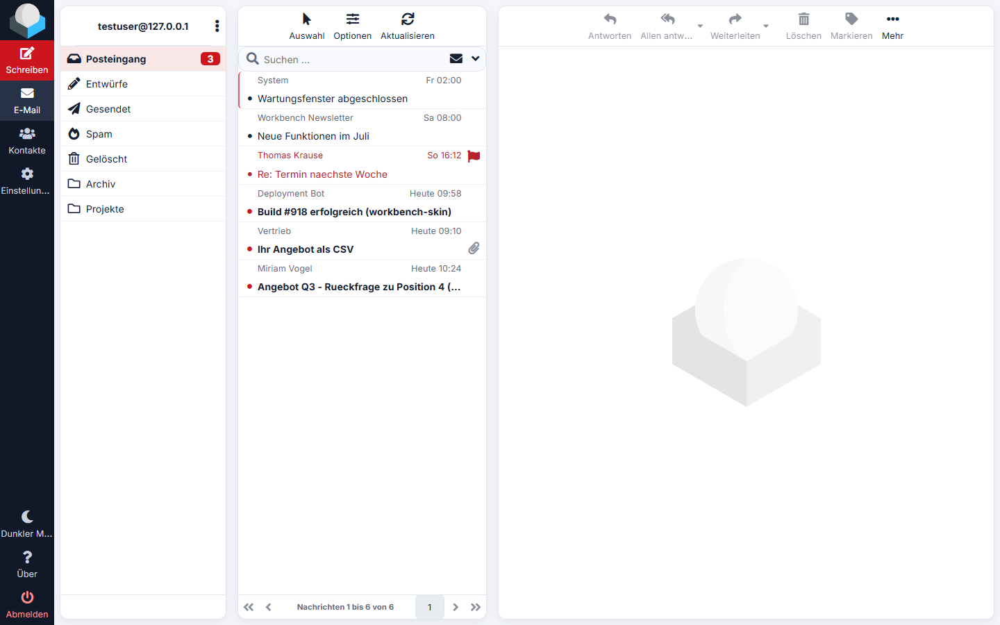
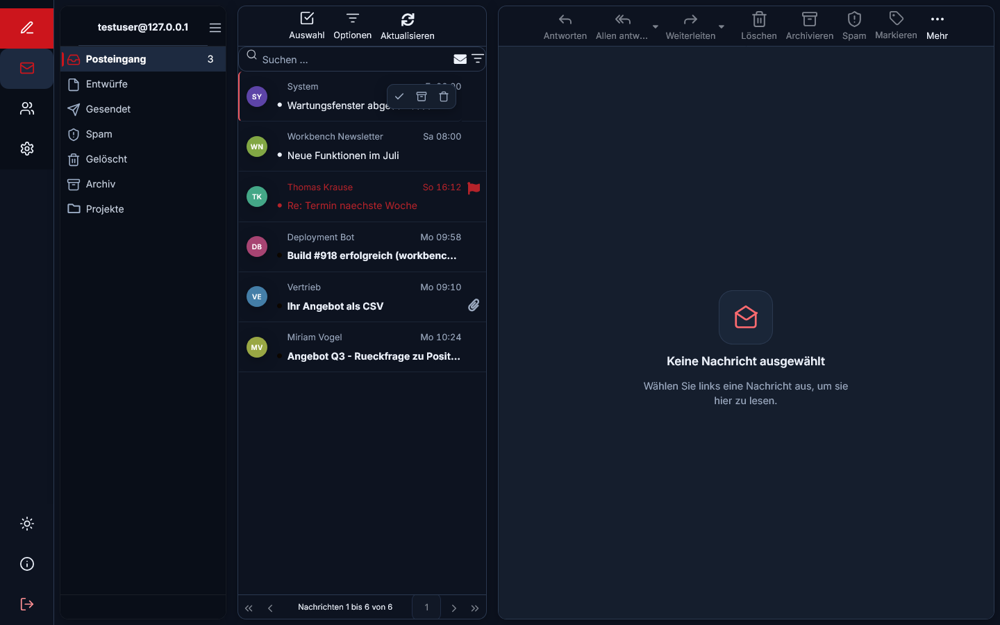
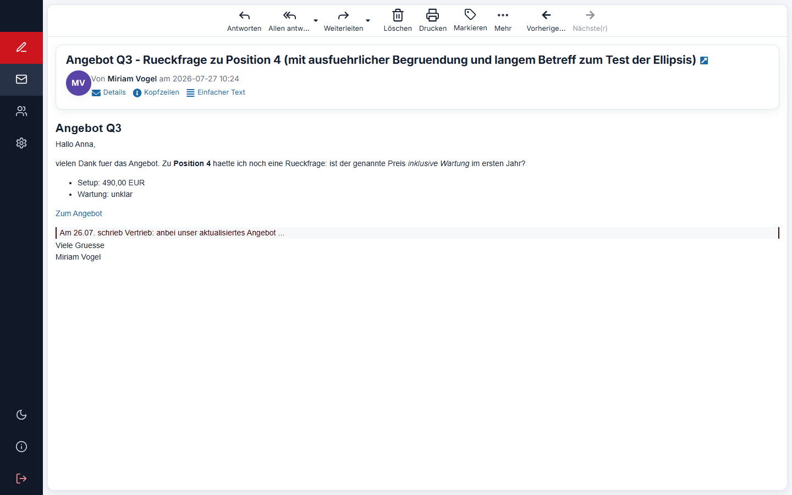

# Roundcube-Skin „workbench"

[](https://packagist.org/packages/ar-sebastian/roundcube-skin-workbench)
[](https://packagist.org/packages/ar-sebastian/roundcube-skin-workbench)
[](LICENSE)

Ein von **Elastic abgeleitetes** Roundcube-Skin im „workbench"-Look: dunkle
Seiten-Navigation, heller Karten-Canvas, roter Marken-Akzent (`#cc151c`),
Inter-Typografie, 12-px-Radien, sichtbarer Fokus, Light **und** Dark. Nur
Oberfläche — der Roundcube-Kern bleibt unverändert. **Marken-neutral / rebrandbar**
(Akzentfarbe = Token `--wb-accent`, Logo in `images/` austauschbar).

- **Basis:** Roundcube 1.6.x, Skin `elastic`
- **Prinzip:** `meta.json` → `"extends": "elastic"`; Overrides ausschließlich in
  `skins/workbench/`. Kein Eingriff in Core, Plugins oder `skins/elastic/`.

## Screenshots

| Login | Posteingang (Light) |
|---|---|
|  |  |

| Posteingang (Dark) | Nachricht lesen |
|---|---|
|  |  |

## Features

- **Light + Dark** über den nativen Roundcube-Toggle (Mond-Button); Tokens auf
  `html.dark-mode`.
- **Icon-only Task-Rail** mit Hover-Tooltips; eigenes Linien-Icon-Set (Lucide-Stil)
  statt der auffälligsten FontAwesome-Glyphen.
- **Initialen-Avatare** in Liste, Lesekopf und Empfänger-Chips (rein kosmetisch, JS).
- **UX-Extras** (dezent, abschaltbar durch Entfernen von `workbench.js`):
  Skeleton-Loader, Top-Progressbar, Hover-Schnellaktionen, Tastatur-Shortcuts
  mit Cheatsheet (`?`).
- **Internationalisierung:** Skin-Localization (`localization/en_US.inc` +
  `de_DE.inc`, `meta.json` → `"localization": true`) für den Login; EN/DE-Wörterbuch
  in `workbench.js` und `watermark.html`, Sprache aus `rcmail.env.lang`.
  **Englisch ist Default.**
- **RTL:** Elastic liefert das Basis-Flip; die Custom-Komponenten (Avatare,
  Hover-Aktionen, Rail-Tooltip, Aktiv-Marker, Lesekopf-Avatar) sind für
  `html[dir="rtl"]` gespiegelt.
- **Touch:** Hover-Schnellaktionen werden auf `@media (hover: none)` ausgeblendet —
  mobil greift die Standard-Toolbar.
- **A11y:** sichtbarer Fokus, `aria-hidden` für dekorative Avatare, Cheatsheet als
  `aria-modal` mit Fokus-Setzen und -Rücksprung.
- **Marken-neutral:** Akzentfarbe = Token `--wb-accent`, Logo in `images/`
  austauschbar. Keine Produkt-/Hersteller-Nennung.

## Kompatibilität

Verifiziert in **Chromium/Chrome** und **Firefox** (Login, Mailliste, Lesen,
Dark-Mode — Custom-Icons via CSS-Maske, Inter-Webfont und Avatare rendern in
beiden identisch). Die Icons nutzen `mask`/`-webkit-mask`, was auch WebKit/Safari
abdeckt.

> Deployment-Hinweis: Firefox wendet Stylesheets nur an, wenn sie mit korrektem
> `Content-Type: text/css` ausgeliefert werden (striktes MIME-Sniffing). Reguläre
> Apache-/nginx-Konfigurationen tun das automatisch; nur bei einem
> Roundcube-Router, der *alle* Requests durch PHP leitet, kann der MIME-Type
> verfälscht werden.

## Aufbau

```
skins/workbench/
  meta.json          extends: elastic, dark_mode_support
  styles/
    _tokens.css      §4 Design-Tokens (--wb-*), Light + Dark, verbatim
    _map.less        Elastic-LESS-Variablen  <=  Workbench-Tokens
    _variables.less  Hook -> @import "_map" (Elastic optional-Variablen-Hook)
    _styles.less     Hook -> Tokens inline + @import "workbench"
    workbench.less    Komponenten-Overrides (Nav/Shell/Listen/Login/Zustände/A11y)
    icons.less       Eigenes Linien-Icon-Set (Lucide-Stil) als CSS-Maske + currentColor
                     — ersetzt die sichtbarsten FontAwesome-Glyphen (Task-Rail,
                     Ordner, Toolbar). Generiert via tools/genicons (nicht von Hand).
    styles.css       kompiliert (wird von Roundcube geladen)
    styles.min.css   minifiziert
    print.css        Palette-Remapping fürs Drucken
    embed.css        Palette-Remapping für Nachrichten-/Editor-Inhalt
  fonts/             Inter 400/500/600/700 (self-hosted) + FontAwesome (aus Elastic)
  images/            logo.svg, logo-dark.svg, favicon.svg (aus workbench-Theme) + OAuth-Icons
  watermark.html     Eigener Leerzustand im Lesebereich (statt Elastic-Logo-Wasserzeichen)
  workbench.js       Skin-JS (kosmetisch/UX): Initialen-Avatare (Liste/Lesekopf/
                     Empfaenger-Chips), Skeleton-Loader, Top-Progressbar,
                     Hover-Schnellaktionen, Tastatur-Shortcuts + Cheatsheet ("?")
  tools/genicons.js  Generator fuer styles/icons.less
  localization/      Skin-Labels (en_US.inc Default, de_DE.inc) fuer den Login
  templates/
    login.html       Override: Zweispalten Hero + Card (begründet, s. u.)
    includes/
      layout.html    Override: identisch zu Elastic + lädt /workbench.js (1 Zeile)
  .evidence/         Vergleichs-Screenshots (nur synthetische Daten)
```

## Build

Kompiliert die **Elastic-Entrypoints** mit `--include-path` auf diesen Skin-Ordner.
Dadurch greifen die offiziellen Elastic-Hooks (`_variables` / `_styles`) unsere
Overrides — **ohne** eine Elastic-Datei zu verändern.

```bash
# aus skins/workbench/
powershell -ExecutionPolicy Bypass -File build.ps1
```

Manuell (Kern des Builds):

```bash
lessc --include-path=skins/workbench/styles skins/elastic/styles/styles.less skins/workbench/styles/styles.css
lessc --include-path=skins/workbench/styles --clean-css skins/elastic/styles/styles.less skins/workbench/styles/styles.min.css
lessc --include-path=skins/workbench/styles skins/elastic/styles/print.less skins/workbench/styles/print.css
lessc --include-path=skins/workbench/styles skins/elastic/styles/embed.less skins/workbench/styles/embed.css
```

Voraussetzung: Node/npm; `lessc` (less@4) + optional `less-plugin-clean-css`.

## Installation

**Composer** (empfohlen, via Packagist):

```bash
composer require ar-sebastian/roundcube-skin-workbench
```

Der `roundcube/plugin-installer` legt das Skin automatisch unter `skins/workbench/` ab.

**Manuell** (Release-Archiv):

```bash
tar xzf workbench-skin-1.1.2.tar.gz -C skins/   # ergibt skins/workbench/
```

Releases: <https://github.com/AR-Sebastian/roundcube-skin-workbench/releases>

## Aktivierung

`config/config.inc.php`: `$config['skin'] = 'workbench';` — oder pro Nutzer in den
Roundcube-Einstellungen. Danach hart neu laden (Assets sind mit `?s=` versioniert).

## Dark-Mode

Roundcube besitzt einen **nativen** Dark-Schalter (Mond-Button im Taskmenu), der
`html.dark-mode` setzt (Cookie `colorMode`). Das Skin legt seine Dark-Tokens auf
`html.dark-mode` **und** auf das WP-Attribut `html[data-wb-theme="dark"]`. Es wird
also der vorhandene, funktionierende Toggle benutzt statt eines fragilen eigenen.

## Bewusste Abweichungen vom WP

1. **Dark-Selektor:** `html.dark-mode` (Roundcube-nativ) statt ausschließlich
   `data-wb-theme` — nutzt den vorhandenen Toggle. `data-wb-theme` bleibt als Alias.
2. **Variablen-Datei** heißt in Elastic `variables.less` (nicht `_variables.less`).
   Der Override läuft über den optionalen `_variables`-Hook via `--include-path`.
3. **Inter** ist self-hosted (WP §4), obwohl das Panel-Theme Inter nur als
   Font-Stack ohne Webfont nutzt. Bezug über npm `@fontsource/inter` (kein CDN).

## Rollback

Skin abwählen (Standard-Elastic aktiv) und Ordner `skins/workbench/` entfernen. Da
keine Core-/Plugin-/Elastic-Dateien verändert wurden, ist der Rückbau vollständig
und ohne Nebenwirkung.
